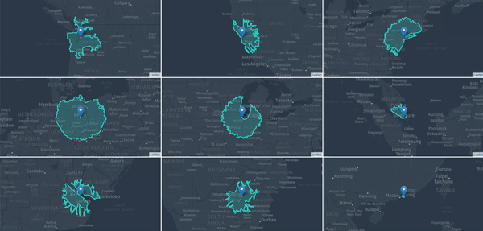

# Interactive Isoline Grid with HERE Dev + React + Leaflet



The [HERE Routing API Isoline](https://developer.here.com/documentation/routing/topics/request-isoline.html) feature is great for calculating the area than can be reaching by traveling for a certain time or distance. A map isoline isn't just a normal circular radius, it is a radius calculated using the road network. For example, the following use cases can be solved with isoline routing:
- Which neighborhoods can I live in that are less than a 30-minute drive from my office?
- How far can my delivery trucks drive in any direction before they need to refuel?
- As a shipping management / logistics company, how can I check if my assets are within a 200-mile road network radius?

In this tutorial, we'll be building a 3x3 map grid of isolines consisting of cities across the globe. The application will let a user explore travel times from a city's core based off the following parameters:
- radius in either distance (meters) or time (seconds)
- radius range
- traffic enabled or disabled

The application will also let us change:
- the styles of all the maps
- the zoom levels of all the maps

As for the tech stack, we'll be employing the help of a few different tools:
- [HERE Maps Routing API](https://developer.here.com/documentation/routing/topics/request-isoline.html) for the isolines
- [React](https://reactjs.org/) for building and rendering the interface
- an abstraction of [Leaflet](https://leafletjs.com/) via [react-leaflet](https://react-leaflet.js.org/), a React wrapper of Leaflet
- [HERE Map Tile API](https://developer.here.com/documentation/map-tile/topics/introduction.html) for the map tiles inside of Leaflet

Why Leaflet?
Leaflet is an open-source mapping library already adopted by many in the web mapping and GIS community. Many of the REST HERE Location Services are compatible with Leaflet, so it makes switching to HERE from another mapping stack easy.

Let's get started!

### Installation

To create the scaffolding for the React app, we'll be using `create-react-app`. Navigate to where you'd like to save your project and run the following commands in your machine's command line:
```
npx create-react-app isoline-grid
cd isoline-grid
npm start
```

The project will require only two external packages: `leaflet` and `react-leaflet`. Go ahead and install them using npm:
```
npm i leaflet react-leaflet
```

`react-leafet` requires a quick hack to get the Leaflet CSS configured properly.
Inside of `public/index.html` and the following line inside of `<head></head>`:

```
<link rel="stylesheet" href="https://unpkg.com/leaflet@1.4.0/dist/leaflet.css" />
```

### HERE & Location Services

Next, let's go ahead and setup everything we'll need from the HERE side of things:
- an App Id and App Code, which can be obtained from the [HERE Developer Portal](https://developer.here.com/). No credit card is required for sign up and requests are free up to 250K transactions per month.
- The HERE Map Tile API request url
- The HERE Routing API isoline request url

Create a new file inside of the `src` directory called `here.js`:

```javascript
export const hereCredentials = {
   id: 'YOUR-HERE-ID',
   code: 'YOUR-HERE-CODE'
}

export const hereIsolineUrl = (coords, options) => `https://isoline.route.api.here.com/routing/7.2/calculateisoline.json?app_id=${hereCredentials.id}&app_code=${hereCredentials.code}&mode=shortest;${options.mode};traffic:${options.traffic}&start=geo!${coords[0]},${coords[1]}&range=${options.range}&rangetype=${options.type}`

export const hereTileUrl = (style) => `https://2.base.maps.api.here.com/maptile/2.1/maptile/newest/${style}/{z}/{x}/{y}/512/png8?app_id=${hereCredentials.id}&app_code=${hereCredentials.code}&ppi=320`;

export const maxIsolineRangeLookup = {
   time: 20000,
   distance: 400000
}
```

Be sure to replace `YOUR-HERE-ID` and `YOUR-HERE-CODE` with the your own credentials!

The functions `hereIsolineUrl()` and `hereTileUrl()` will return the appropriate request urls from the Routing API's isoline and the Map Tile API. We'll be passing options to both of these functions later on in the app.

### Styling

`create-react-app` already includes a CSS file called `app.css`. Go ahead and delete everything in there and replace it with the following:

```css
.app {
   height: 100%;
   display: flex;
   flex-direction: column;
   position: absolute;
}

.controls {
   box-sizing: border-box;
   padding: 20px;
   width: 100%;
   display: grid;
   grid-template-columns: repeat(6, 1fr);
}

.map-grid {
   height: 100%;
   width: 100vw;
   display: grid;
   grid: repeat(3, 1fr) / repeat(3, 1fr);
   position: relative;
   grid-gap: 3px;
}

.map {
   border: 3px solid white;
}

label {
   display: block;
}
```
`map-grid` is the container for all 9 of the maps. We are using [CSS grid](https://css-tricks.com/snippets/css/complete-guide-grid/) to easily create the 3 by 3 grid.

### Creating the Maps

To house each one of our maps, we'll be creating a reusable component called `MapContainer`. Go ahead and create a new file titled `MapContainer.js` inside of the `src` directory.

Inside of this file, we'll need to import a few things. Ensure the beginning of `MapContainer.js` looks like:

```javascript
import React from 'react';
import { Map, TileLayer, Marker, Polygon } from 'react-leaflet';
import { hereTileUrl } from './here';
```

Just like any other React project, we need to import `react`. Additionally, we are importing the `react-leaflet` module we will be using. We also import the `hereTileUrl` function to display the HERE tiles inside of Leaflet.

The rest of the `MapContainer` component will look like:

```javascript
export class MapContainer extends React.Component {

   constructor(props) {
      super(props);
      this.marker = React.createRef();
   }

   handleDrag = () => {
      const coordinates = this.marker.current.leafletElement.getLatLng();
      this.props.handleDrag(this.props.index, [coordinates.lat, coordinates.lng]);
   }

   render() {
      return (
            <Map
               center={this.props.center}
               zoom={parseInt(this.props.options.zoom)}
               zoomControl={false}
               attributionControl={this.props.index === 8}
            >
               <TileLayer
                  url={hereTileUrl(this.props.style)}
               />
               <Marker
                  position={this.props.center}
                  draggable={true}
                  onDragEnd={this.handleDrag}
                  ref={this.marker}

               />
               {
                  this.props.polygon.length > 0 &&
                  <Polygon
                     positions={this.props.polygon}
                     color="#2DD5C9"
                  />
               }
            </Map>
      )
   }
}
```
Inside of `render()`, we are creating a few different `react-leaflet` components:
- `<Map />` is the standard map controller. We are passing it the props `center` and `zoom`. `attributionControl` is set to only show attribution on the bottom right map, because we don't need 9 different attribution labels in our app.
- `<TileLayer />` is where we pass the HERE Tile API url. We also pass the function the prop `style`, which is the style chosen by the user (day, night, normal, etc.) in the main application.
- `<Marker />` is the blue marker on each map. This marker can be dragged to reset the position of isoline.
- `<Polygon />` is the isoline polygon on each map. `<Polygon />` is only shown if the props `polygon` has a length greater than 0. This is because each map's polygon array is set to an empty array before the initial call to the Routing API isoline is made (more on this in `App.js`).


The function `handeDrag()` is called when the user stops dragging the marker. This function grabs the updated position of the marker, and then sends it back up to the parent component, `App.js`, to update the isoline polygon with a new center.

### Constructing the parent component

Now that we have the `MapContainer` all set up, let's start working on the parent component. `create-react-app` has already created the `App.js` file for us. Go ahead and delete everything in there.

Add the following imports:
```javascript
import React from 'react';
import './App.css';
import { MapContainer } from './MapContainer';
import { hereIsolineUrl, maxIsolineRangeLookup } from './here';
```

Let's go ahead and setup the class's constructor:

```javascript


class App extends React.Component {

   constructor(props) {
      super(props);
      this.state = {
         //Coordinates are in format [Latitude, Longitude]
         maps: [
            {
               name: 'Seattle, WA',
               coordinates: [47.605779, -122.315744],
               polygon: []
            }, {
               name: 'San Francisco, CA',
               coordinates: [37.761732, -122.440343],
               polygon: []
            }, {
               name: 'New York City, NY',
               coordinates: [40.734238, -73.988188],
               polygon: []
            }, {
               name: 'Berlin, Germany',
               coordinates: [52.520609, 13.409321],
               polygon: []
            }, {
               name: 'Chicago, IL',
               coordinates: [41.884314, -87.630478],
               polygon: []
            }, {
               name: 'Singapore, Singapore',
               coordinates: [1.347920, 103.862097],
               polygon: []
            }, {
               name: 'Buenos Aires, Argentina',
               coordinates: [-34.609855, -58.443259],
               polygon: []
            }, {
               name: 'Johannesburg, South Africa',
               coordinates: [-26.205689, 28.042450],
               polygon: []
            }, {
               name: 'Tokyo, Japan',
               coordinates: [35.652832, 139.839478],
               polygon: []
            }
         ],
         options: {
            zoom: 5,
            type: 'distance',
            range: 300000,
            mode: 'car',
            traffic: 'disabled',
            style: 'reduced.day'
         }
      };
   }
}
```
Inside of the constructor, we configure the initial state of the application. Inside of the `state` object, `maps` is an array of objects containing the configuration for each map. Each map object has the:
- name of the map (not used in the application code, just for context)
- coordinates: used for the center of the map view, the position of the marker, and the center of the isoline radius
- polygon: the array of coordinates consisting of the isoline polygon. This is an empty array for now because the initial API requests have not been made.

Inside the `state` object, there is also another object called `options`. `options` will hold the information on the current state of the isoline and map settings. We will update this nested object when the user changes the inputs at the top of the map.

### Rendering the parent component

Now that we've configured the initial state of the application, let's write some code on what the application should render.

Inside of the `App.js`'s `App` Component, let's add a `render` function:

```javascript
render() {

   const max = this.state.options.type === 'distance' ?
      maxIsolineRangeLookup.distance :
      maxIsolineRangeLookup.time;

   const sliderVal = this.state.options.range > max ? max : this.state.options.range;

   return (
      <div className="app">
         <div className="controls">
            <div>
               <label htmlFor="type">Distance or Time</label>
               <select
                  id="type"
                  value={this.state.options.type}
                  onChange={this.handleFormChange}
               >
                  <option value="time">Seconds</option>
                  <option value="distance">Meters</option>
               </select>

            </div>
            <div>
               <label htmlFor="range">
                  Range ({parseInt(this.state.options.range).toLocaleString()})
               </label>
               <input
                  id="range"
                  onChange={this.handleFormChange}
                  type="range"
                  min="1"
                  max={max}
                  value={sliderVal}
               />
            </div>
            <div>
               <label htmlFor="mode">Mode</label>
               <select
                  id="mode"
                  onChange={this.handleFormChange}
                  value={this.state.options.mode}
               >
                  <option value="car">Car</option>
                  <option value="pedestrian">Pedestrian</option>
               </select>
            </div>
            <div>
               <label htmlFor="traffic">Traffic</label>
               <select
                  id="traffic"
                  onChange={this.handleFormChange}
                  value={this.state.options.traffic}
               >
                  <option value="enabled">Traffic Enabled</option>
                  <option value="disabled">Traffic Disabled</option>
               </select>
            </div>
            <div>
               <label htmlFor="zoom">Zoom Level ({this.state.options.zoom})</label>
               <input
                  id="zoom"
                  onChange={this.handleFormChange}
                  type="range"
                  min="1"
                  max="16"
                  value={this.state.options.zoom}
               />
            </div>
            <div>
               <label htmlFor="style">Map Style</label>
                  <select
                     id="style"
                     onChange={this.handleFormChange}
                     value={this.state.options.style}
                  >
                     <option value="reduced.day">Reduced Day </option>
                     <option value="reduced.night">Reduced Night</option>
                     <option value="normal.day">Normal Day</option>
                     <option value="normal.night">Normal Night</option>
                  </select>
            </div>
         </div>
         <div className="map-grid">
            {this.state.maps.map((map, index) =>
               <MapContainer
                  key={index}
                  index={index}
                  center={map.coordinates}
                  options={this.state.options}
                  handleDrag={this.handleDrag}
                  polygon={map.polygon}
                  style={this.state.options.style}
               />
            )}

         </div>
      </div>
   );
}
```

Inside of `render()`, we are rendering the two main parts of the application: the controls area and the maps.

Inside of the `<div>` with the className `controls`, we are rendering 6 different inputs. With each input, we have attached `onChange` events, so the maps can change dynamically based on these values (more on this soon).

Scroll down through the controls `<div>` until you find the `map-grid` `<div>`. Inside of this `<div>` is where we will render each of the nine maps. I used the `.map()` function to conveniently return each of the 9 maps with the required props. Some of the important props:
- `handleDrag` is the event handler prop for when the user drags the position of the marker
- `polygon` is the isoline polgyon data passed down to the map container to render

### Calling the Routing API for Isolines

Inside of the `App` Component, paste the following code:

```javascript
updateIsolines = () => {
   const promises = this.state.maps.map(m => fetch(hereIsolineUrl(m.coordinates, this.state.options)).then(x => x.json()));
   Promise.all(promises).then(res => {
      const copy = this.state.maps.map((x, i) => {
         x.polygon = res[i].response.isoline[0].component[0].shape.map(x => [x.split(',')[0], x.split(',')[1]]);
         return x;
      });
      this.setState({
         maps: copy
      });
   });
}

componentDidMount = () => {
   this.updateIsolines();
}
```

When the application starts, we'll want to call the Routing API for the isolines. With React, the appropriate lifecycle function for this is `componentDidmount()`.

However, we will be writing code to update all the isolines at once later on in the application. For example, we'll need to update each map's isoline when the user changes a value through the inputs at the top of the page. Because of this, I decided to create a shared function called `updateIsolines()`. `updateIsolines()` will make a request to the Routing API and then update each `state`'s `map` `polygon` array with updated data. Whenever the application's state is updated, React will go ahead and update the application's UI.

What about when I don't need to update every isoline at once? When the user drags a marker around on a map, we need to present a new isoline. However, when the user drags a marker on one map, it doesn't affect the other map's isolines. Due to this, it would be inefficient to call `updateIsolines()` on the marker drag event.

Let's write some code to only update a single isoline at a time. Add the function `handleDrag()` to the `App` component:

```javascript
handleDrag = (index, coordinates) => {
   fetch(hereIsolineUrl(coordinates, this.state.options))
   .then(res => res.json())
   .then(res => {
      const copy = this.state.maps.slice();
      if (res.hasOwnProperty('response')) {
         copy[index].polygon = res.response.isoline[0].component[0].shape.map(x => [x.split(',')[0], x.split(',')[1]]);
      } else {
         copy[index].polygon = [];
      }
      copy[index].coordinates = coordinates;
      this.setState({
         maps: copy
      });
   });
}
```

`handleDrag()` is only called when a marker is moved on a map. The function works similar to `updateIsolines()`, except we only update one map's isoline. Additionally, I've added some basic error handling in the event the user drags a marker to an area where an isoline is not available, such as an ocean or a lake.

### Adding life to the control inputs

Our app is currently rendering the input controls at the top of the page, but we haven't written any code to connect the inputs to the application.

Inside of the `App` component, let's add our final function to the application:
```javascript
handleFormChange = (event) => {
   const option = event.target.id;
   const value = event.target.value;
   const copy = this.state.options;
   if (option === 'type' && this.state.options.range > maxIsolineRangeLookup[value]) {
      copy.range = maxIsolineRangeLookup[value];
   }
   copy[option] = value;
   this.setState({
      options: copy
   }, () => {
      this.updateIsolines();
   });

}
```
`handleFormChange()` is called whenever one of 6 inputs is changed. The function updates the app's `state`, specifically the `options` object.

This function also contains some logic around limiting the max range value. The max range for a distance isoline is 400,000 meters, while the max range for a time isoline is 20,000 seconds, so we'll want to update the value of the range when switching between the two types of ranges to avoid any errors with passing too large of values to the Routing API isoline.

### Wrapping it all up

By now, you will have a working isoline grid application. It's fun to play around and compare the possible travel radiuses between the different cities. Feel free to edit the default cities in the application's state to add some more relevant cities to you.

Take a look at the [live demo](https://dbabbs.github.io/isoline-grid/) or project's the [source code](https://github.com/dbabbs/isoline-grid).

Make anything cool with HERE location services? Be sure to share with us on Twitter at [@dbabbs](https://twitter.com/dbabbs) or [@heredev](https://twitter.com/heredev).

Happy coding!
